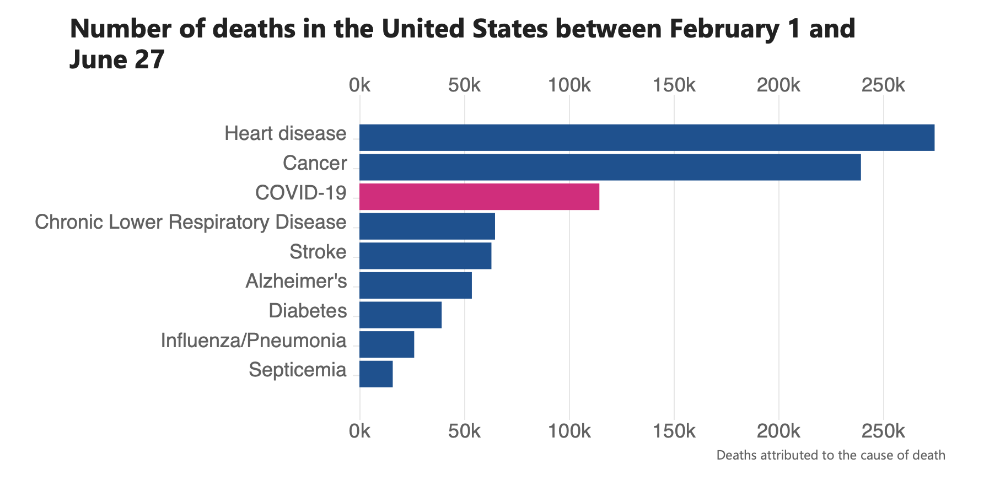

```{r setup, include=FALSE}
knitr::opts_chunk$set(echo = TRUE)
library(readr)
```


## Team

Name             | NetID
---------------- | -------------
Amandeep Takhar  | atakhar2
Kumar Gaurav     | Kgdubey2
Vishal Agarwal   | vishala2


## Tentative Title
**Save your heart**
<br/>
\newline
<span style="color: blue;">An analysis on factors contributing to heart disease</span>
 
 
## Dataset
 
#### Background

This dataset comes from Kaggle, It's generated from a cardiovascular study on residents of the town of Framingham, Massachusetts. The dataset contains 4240 records and 14 predictors.
<br/>
We will also try to find a dataset from some other location and it will be interesting to analyze if the results change by geographical location or race.
<br/>
[Source Dataset](https://www.kaggle.com/amanajmera1/framingham-heart-study-dataset)


#### Description
 
```{r, echo=FALSE}
library(knitr)
variables = c("male",
              "age", 
              "education",
              "currentSmoker",
              "cigsPerDay",
              "BPMeds",
              "prevalentStroke",
              "prevalentHyp",
              "diabetes",
              "totChol",
              "sysBP",
              "BMI",
              "heartRate",
              "glucose",
              "TenYearCHD")
types = rep("numerical", length(variables))
types[1] = "numerical(response)"

description = c('Male(1) or Female(0)', 'Education of the person(higher the number means more educated)', 'Age of the patient (rounded to whole number)', 'Current smoker or not', 'The number of cigarettes consumed in a day', 'Whether or not the patient is on BP med', 'Whether or not the patient had a stroke in past', 'Whether or not the patient was hypertensive', 'Total cholesterol level', 'Systolic blood pressure', 'Diastolic blood pressure',
 'Mass Index', ' Heart rate', 'Glucose level', '10 year risk of coronary heart disease CHD (binary: “1”, means “Yes”, “0” means “No”) -Target predicted variable')
kable(data.frame(Variables=variables, Type=types,  Description=description))
```

## Personal interest

According to the CDC, heart disease is the number one cause of deaths in the USA and also worldwide.Even when we are surrounded by pandemics with thousands of people dying every day, deaths related to heart still stand at number one position.




Equipped with the knowledge gained over the semester, we feel well prepared in order to understand how a predictive model can help us predict within a reasonable amount of confidence the impact of underlying causes of a stroke 10 years down the line. This will eventually help people adopt a healthier lifestyle to reduce the risk of any cardiovascular disease.

<span style="color: blue;">Personally, We would like to explore how statistics combined with technology can make difference in people's life and encourage them take informed decisions in time.We are given different predictors like age,education,BP etc.Our aim would be through statistics let an individual know how he can reduce chances of a heart disease if he improves x number of conditions today (for example improve his BP or quit smoking)</span>


## Evidence of the Data

Included below is how the data from source Kaggle, The source format was csv and can be read into R. Below is the sample records from the source file.


```{r kable}
library(readr)
framingham <- read.csv("datasets-framingham.csv")
knitr::kable(head(framingham)[,1:16])
```
